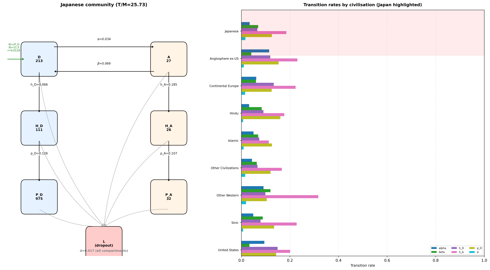
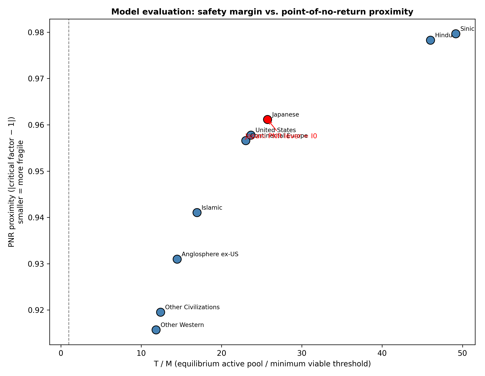

# Sustaining Heterogeneity through Interventions in Global AI/ML Researcher Mobility: A Transition-Rate Framework

**Article type:** Research Article

## Abstract

Artificial intelligence (AI) and machine learning (ML) research is increasingly concentrated in a few regions, raising the risk that smaller research communities fall below a minimum viable coauthor pool and cannot recover. We model each civilisation as a six-compartment system of domestic and abroad early-career, high-impact, and principal-investigator researchers, and estimate transition rates from OpenAlex Artificial Intelligence works (subfield 1702). The minimum viable coauthor threshold is defined as M = k × c_bar, where c_bar is the mean number of authors per work and k is the median number of distinct last-author groups observed per recent year. Across 9 groups, equilibrium domestic active pools remain above their thresholds, but the closest point of no return (PNR) is observed for the Other Western group, where I0 must be multiplied by 0.084× its current value (equivalent to a 92% proportional reduction) to drive the active pool to its threshold. A simulated reduction in dropout yields the largest margin gain per unit proportional change in every group in the fitted model. The 2017-2023 out-of-sample projection records RMSE 29.62 and a conservative, non-standard MAPE of 137.3% (computed against count_obs + 1 to avoid division by zero). That level of error is expected because the projection is designed as an early-warning indicator of directional drift and threshold crossing, not as a precise population forecast. Historical and saturating-inflow counterfactuals show that the model is most sensitive to exogenous entry and attrition. These results provide a quantitative framework for early, safety-factor-bound policy scenarios that preserve civilisational diversity in AI/ML research.

**Keywords:** researcher mobility; artificial intelligence; civilisation grouping; ordinary differential equations; PNR; innovation studies

## Highlights

- Nine civilisations modelled as six-compartment ODEs fitted to OpenAlex AI/ML data.
- Closest PNR: Other Western via I0 (factor 0.084×).
- Dropout reduction gives the largest margin gain per 10% change across all groups in the fitted model.

## Data and Code Availability

This study uses publication metadata from the OpenAlex API (subfield 1702, Artificial Intelligence; 2000–2023). The extraction and analysis code, the country-to-civilisation mapping, and the result CSVs used to generate this manuscript are available in the public GitHub repository https://github.com/bougtoir/researcher-mobility-ode. OpenAlex data are released under CC0.

## Declarations

**Funding:** [To be completed / removed for double-blind review]

**Competing interests:** [To be completed / removed for double-blind review]

**Author contributions:** [To be completed / removed for double-blind review]

**Acknowledgments:** Yamada Y (momentumyy). 海外で当てた研究者はその後どうなるのか. note.com, 2026. https://note.com/momentumyy/n/n86df5d34282d (accessed 2026-08-09).

## 1. Introduction

Most debates on research mobility focus on net flows: which country gains researchers and which loses them. Net-flow accounting is useful for headlines, but it hides the transition rates that actually move researchers between career stages and locations. A small proportional change in one of those rates can, over time, push a research community below the minimum coauthor pool it needs to remain viable. Once the pool falls below that threshold, recovery becomes difficult or impossible, even if policy is later reversed. That is the point of no return (PNR) that motivates this paper.

Artificial intelligence and machine learning have become the archetypal general-purpose technologies of the current era [5,6,7]. Their development depends on a relatively small, highly mobile workforce of doctoral and post-doctoral researchers, principal investigators, and research engineers [1]. The geographic concentration of this workforce has generated both scientific and geopolitical concern. Policymakers in the United States, China, Europe, Japan, India and elsewhere now treat AI talent as a strategic input, and several governments have introduced incentives to attract or retain researchers [4,5]. Most of those policies are evaluated by their immediate net-flow effects. They rarely ask which transition in the career pipeline is the binding constraint, or how close a community is to a threshold where the field can no longer sustain itself.

The civilisation framework offers a natural way to partition the global research population into culturally and institutionally coherent arenas [4]. We adapt Huntington's nine civilisations for AI/ML mobility by keeping the United States, China (Sinic), India and nearby South Asian countries (Hindu), Japan, and the Islamic world as distinct groups, splitting the Western bloc into the United States, Anglosphere excluding the United States, Continental Europe and Other Western, and merging the smaller Latin American, Orthodox and African communities into Other Civilizations. This grouping reflects the empirical size and mobility patterns observed in the data rather than a normative claim about civilisational identity.

The central argument of the paper is that preserving civilisational diversity in AI/ML is not only a normative preference but also a safeguard against technological dead ends. When a single region or a small oligopoly dominates a field, the set of research questions, evaluation norms, and institutional incentives narrows [5]. A diverse ecosystem generates competing approaches, which increases the probability that unexpected breakthroughs and error correction survive [5]. If transition rates can be observed with enough temporal resolution, policy can intervene before a community reaches the PNR. Early, proportionate interventions can prevent the emergence of a monopoly or oligopoly without requiring large ex post rescues.

We therefore address five research questions. First, how close is each civilisation to the PNR in its AI/ML research community? Second, which transition rates have the largest effect on community size? Third, how have transition rates changed between earlier and later career cohorts, and what would have happened if those rates had persisted? Fourth, what safety-factor-bound single-lever and multi-lever policy scenarios can widen the margin before a PNR is reached? Fifth, can the fitted rates be estimated year by year and used to project near-term population composition, and how well do those projections reproduce observed 2017-2023 counts?

The contribution is a reproducible, data-driven transition-rate model that links OpenAlex publication records to a system of ordinary differential equations. The model is intentionally simple: it does not explain why a rate is high or low, but it identifies which rate is closest to a threshold and therefore where early intervention is most urgent.

## 2. Literature and conceptual framework

Researcher mobility has long been studied under the headings of brain drain, brain circulation and brain gain [3,4,9]. Thorn and Holm-Nielsen argue that the mobility of researchers from developing countries can become a gain when return migration and diaspora networks are supported, but it can become a drain when local research environments cannot retain or reproduce talent [7]. Appelt et al., using a gravity framework for 1996-2011, find that scientific collaboration, economic convergence and visa restrictions are the strongest correlates of bilateral mobility [2]. Their analysis shows that mobility is multi-directional: a large share of researcher movement is better described as circulation than as one-way migration.

The AI/ML literature has documented the same patterns at higher resolution. MacroPolo's Global AI Talent Tracker finds that the United States remains the leading destination for top-tier AI researchers, while China and India are expanding domestic retention [1]. AlShebli et al. show that U.S.-China collaboration in AI is more impactful than either country working alone, and that most mobile AI scientists retain collaboration links with their origin country [8]. Yuan et al. find that the brain-drain problem for AI scientists is increasingly serious in developing countries, and that the ties among AI elites are highly clustered [9]. These studies establish that AI/ML talent is mobile, concentrated and strategically important.

What is missing is a formal link between individual transition rates and the long-run viability of a research community. The concept of a minimum viable population, introduced by Shaffer, captures the smallest isolated population that has a high probability of persisting despite demographic, environmental and genetic stochasticity [10]. Transferred to science, the equivalent idea is a minimum viable coauthor pool: the smallest number of active researchers that can continue to produce work at the field's observed coauthor intensity. Below that pool, collaboration networks fragment, mentorship chains break, and the field enters a self-reinforcing decline.

This framing generates four testable hypotheses. H1: Across all groups, the equilibrium active pool exceeds the minimum viable threshold, but the distance to the threshold varies widely. H2: Dropout is the transition rate with the largest negative effect, because attrition removes researchers from every compartment. H3: The largest positive transition lever is domestic hit generation (h_D), followed by return from abroad (β). H4: Smaller civilisations, and those with older cohort structures, sit closer to their PNR.

## 3. Data and grouping

We extracted AI/ML works and author histories from the OpenAlex API for subfield `subfields/1702` (Artificial Intelligence), using works published between 2000 and 2023 [2]. Authors were assigned to a civilisation by the majority country of their affiliated institutions. The mapping is documented in the repository and is reproduced here only in summary. The final groups are: United States, Anglosphere ex-US, Continental Europe, Sinic, Japanese, Hindu, Islamic, Other Western, and Other Civilizations.

The cohort is restricted to authors whose first observed AI/ML publication year (career-start year) is between 2000 and 2016 and who have at least two AI/ML works in the 2000-2023 window. An author is treated as active if they have at least one AI/ML work in 2020-2023, and as having dropped out otherwise. A 'hit' work is a paper on which the author is not the last author and whose citation count places it in the top 10% of AI/ML works in the same publication year, observed within the first eight career years. An author is classified as a principal investigator (PI) if their first last-author paper appears during the observation window; single-authored papers are treated as last-author papers so that culturally varying coauthorship norms do not bias the seniority proxy [3]. The abroad flag is set if the author is affiliated with a non-origin civilisation within the first six career years. Table 1 reports the size and composition of the extracted cohort. The sample is a reproducible pilot extraction; absolute counts are small because the goal is to demonstrate the transition-rate framework rather than to provide a definitive census of global AI/ML researchers.

| Group | Authors | Works | Active | Hits | PIs | Career start | Abroad |
|---|---|---|---|---|---|---|---|
| Anglosphere ex-US | 187 | 15538 | 156 | 137 | 167 | 2006.6 | 93 |
| Continental Europe | 497 | 24099 | 375 | 354 | 420 | 2007.4 | 153 |
| Hindu | 203 | 7356 | 179 | 114 | 177 | 2010.5 | 35 |
| Islamic | 194 | 5133 | 165 | 94 | 173 | 2010.6 | 50 |
| Japanese | 230 | 9279 | 171 | 110 | 172 | 2007.0 | 42 |
| Other Civilizations | 223 | 6043 | 168 | 109 | 173 | 2008.9 | 51 |
| Other Western | 145 | 6286 | 103 | 103 | 115 | 2008.3 | 61 |
| Sinic | 383 | 17915 | 336 | 216 | 339 | 2008.0 | 97 |
| United States | 364 | 19177 | 299 | 271 | 322 | 2007.6 | 158 |

## 4. Methods

### 4.1 Compartment model

Each civilisation is represented by six compartments: domestic early-career researchers (D), abroad early-career researchers (A), domestic hit researchers (H_D), abroad hit researchers (H_A), domestic principal investigators (P_D), and abroad principal investigators (P_A). Transition rates are early-career outflow (α), return (β), hit generation at home and abroad (h_D and h_A), PI promotion at home and abroad (p_D and p_A), and dropout from all compartments (d). The equations are written in Word equation objects in the body of the manuscript.

### 4.2 Endogenous inflow

New entrants are modelled as a function of the domestic PI stock. The linear form is I(P_D) = I_0 + r P_D, with r capped at 0.50× the stability-critical value (safety factor 0.50). A saturating alternative, I(P_D) = I_0 + r P_D / (1 + ε P_D), is reported as a robustness check.

### 4.3 Minimum viable coauthor threshold

For each group we computed the mean number of authors per work (c_bar) and the median number of distinct last-author groups observed per recent year (k). The minimum viable domestic active pool is M = k × c_bar. When the equilibrium active pool T = D + H_D + P_D falls below M, the community can no longer produce works at the observed coauthor intensity.

### 4.4 Estimation and equilibrium

Transition rates are estimated as constant per-year hazards from observed proportions within the cohort, with Laplace smoothing to avoid zero probabilities. The ODE system is solved at steady state for each group. Elasticities are computed by perturbing each rate by 1% and re-solving. For point-of-no-return analysis we scale each rate until the active pool reaches M and record the critical factor and its proximity, |critical factor − 1|. Historical counterfactuals split the cohort at career-start year 2010 and re-estimate all rates for the early and late windows. Bootstrap confidence intervals are obtained by resampling authors with replacement. Policy counterfactuals apply proportional changes to individual rates and report the resulting change in safety margin.

### 4.5 Annual transition-rate estimation and projection

The steady-state model in Sections 4.1-4.4 treats rates as constants. To test whether the same framework can be used for short-run monitoring, we reconstructed year-by-year compartment membership from cohort.csv and raw_sampled_works.json. For each author and year we inferred location as domestic if the author was in the origin civilisation and abroad otherwise, using sampled works when available and cohort-derived abroad/return years as a fallback. From these states we computed annual transition counts for the six compartments, applied Laplace +0.5 smoothing to empty destination cells, and derived the probabilities that map to α, β, h_D, h_A, p_D, p_A and d. Inter-civilisation flows are approximated by assigning each abroad author-year to the author's recent_group as the destination civilisation; this is a lower-bound proxy because year-to-year destination changes are not observed in the public cohort.

For the 2017-2026 projection we fit a linear trend to the observed 2000-2016 rates for each group and rate. If fewer than four observations were available or the fit explained less than 10% of the variance, the historical mean was used instead. Projected rates were clipped to values between 0 and 1. Dropout was capped at 1.5 times the 90th percentile of observed dropout rates in the training window to prevent implausible extrapolation. Projected total inflows were apportioned across compartments using the first-compartment distribution observed over the 2000-2016 training period. Population composition was projected forward with the discrete-time recursion N(t+1) = N(t)P(t) + b(t+1), where P(t) is a 6×6 row-stochastic-in-expectation matrix that preserves dropout mass: the row sum is 1 − d after scaling outgoing rates. This discrete step is the operational counterpart of the continuous-time ODE; with an annual dt it provides an early-warning signal one year ahead.

We compare the 2017-2023 projection with the observed annual stock. The comparison is limited to years that have observed data, and the observed stock is reindexed to the full group-year-compartment grid so that zero-observed cells are not omitted from the accuracy metrics. Accuracy is reported as RMSE and MAPE; MAPE here is computed against count_obs + 1 to avoid division by zero and is therefore a conservative, non-standard measure.

### 4.6 Correction pressures and theoretical bounds

The annual estimates contain several regularising pressures that bound the model away from instability and fabrication. Laplace smoothing adds a uniform prior of 0.5 to every possible destination, which shrinks sparse cells toward 1/(number of destinations) and prevents zero-probability singularities when a transition is unobserved in a small group-year. It is equivalent to a weak Dirichlet prior and is a standard regulariser for sparse multinomial transitions.

Clipping projected rates to values between 0 and 1 is a feasibility pressure: rates outside the probability simplex are inadmissible. The dropout cap is a safety pressure motivated by the fact that unbounded linear extrapolation of observed attrition would eventually predict more leavers than the total stock. The inflow apportionment pressure keeps the composition of new entrants aligned with the most recently observed recruitment pattern, rather than inventing a new distribution. Finally, the safety factor of 0.50 on the endogenous PI-driven inflow keeps the system inside the stability boundary. Together these pressures embody the principle that projection should stay within observed empirical support and within theoretical stability limits; they are not arbitrary adjustments but transparent bounds that can be tightened or relaxed as more data become available.

## 5. Results

Table 2 reports the equilibrium domestic active pool T, the minimum viable threshold M, and the endogenous inflow parameters for the 9 groups. All groups remain above their threshold under the fitted model, but margins differ by an order of magnitude.

| Group | T_eq | M | Margin | T/M | I0 | r | r_obs | r_crit |
|---|---|---|---|---|---|---|---|---|
| Anglosphere ex-US | 1735.04 | 119.78 | 1615.27 | 14.49 | 9.95 | 0.01 | 0.06587 | 0.01262 |
| Continental Europe | 2972.19 | 129.07 | 2843.13 | 23.03 | 24.97 | 0.01 | 0.06961 | 0.02030 |
| Hindu | 3039.30 | 66.04 | 2973.26 | 46.02 | 11.22 | 0.00 | 0.06746 | 0.00818 |
| Islamic | 2145.59 | 126.52 | 2019.07 | 16.96 | 10.44 | 0.01 | 0.06596 | 0.01127 |
| Japanese | 1298.98 | 50.48 | 1248.50 | 25.73 | 11.50 | 0.01 | 0.07866 | 0.02359 |
| Other Civilizations | 1299.44 | 104.60 | 1194.84 | 12.42 | 11.18 | 0.01 | 0.07582 | 0.02241 |
| Other Western | 678.10 | 57.17 | 620.93 | 11.86 | 6.99 | 0.01 | 0.07417 | 0.02670 |
| Sinic | 5524.20 | 112.34 | 5411.85 | 49.17 | 21.09 | 0.00 | 0.06646 | 0.00850 |
| United States | 3136.83 | 132.49 | 3004.33 | 23.68 | 19.21 | 0.01 | 0.06650 | 0.01366 |

**Figure 1. Equilibrium domestic active pool (T) and minimum viable coauthor threshold (M) by group.** All groups remain above the threshold, but the margin varies widely.

Table 3 shows the three transition-rate elasticities with the largest absolute impact on T for each group. Dropout (d) is the largest negative lever in every group, with an elasticity between -2.31 and -2.09 for the active pool. The largest positive transition lever is domestic hit generation (h_D), followed by return from abroad (β). The Other Western group shows the highest sensitivity to PI promotion (p_D), indicating that strengthening domestic promotion is especially important for that community.

| Group | 1st rate | 1st elasticity | 2nd rate | 2nd elasticity | 3rd rate | 3rd elasticity |
|---|---|---|---|---|---|---|
| Anglosphere ex-US | d | -2.221 | beta | 0.163 | h_D | 0.136 |
| Continental Europe | d | -2.235 | h_D | 0.144 | beta | 0.097 |
| Hindu | d | -2.094 | h_D | 0.079 | p_D | 0.038 |
| Islamic | d | -2.184 | h_D | 0.122 | beta | 0.072 |
| Japanese | d | -2.308 | h_D | 0.194 | p_D | 0.100 |
| Other Civilizations | d | -2.314 | h_D | 0.189 | beta | 0.109 |
| Other Western | d | -2.307 | h_D | 0.131 | p_D | 0.126 |
| Sinic | d | -2.117 | h_D | 0.078 | beta | 0.045 |
| United States | d | -2.217 | h_D | 0.157 | beta | 0.153 |

Table 4 reports, for each group, the single rate that reaches the active-pool threshold with the smallest proportional change. The Other Western group is the most fragile: I0 must be multiplied by 0.084× its current value (equivalent to a 92% proportional reduction) to drive the active pool to its minimum viable threshold. I0 is the closest point-of-no-return lever for the active researcher pool in every group.

| Group | Target | Rate | Current | Critical factor | Proximity |
|---|---|---|---|---|---|
| Other Western | domestic_active | I0 | 6.9942 | 0.084 | 0.916 |
| Other Civilizations | domestic_active | I0 | 11.1792 | 0.080 | 0.920 |
| Anglosphere ex-US | domestic_active | I0 | 9.9459 | 0.069 | 0.931 |
| Islamic | domestic_active | I0 | 10.4370 | 0.059 | 0.941 |
| Continental Europe | domestic_active | I0 | 24.9731 | 0.043 | 0.957 |
| United States | domestic_active | I0 | 19.2127 | 0.042 | 0.958 |
| Japanese | domestic_active | I0 | 11.5005 | 0.039 | 0.961 |
| Hindu | domestic_active | I0 | 11.2175 | 0.022 | 0.978 |
| Sinic | domestic_active | I0 | 21.0883 | 0.020 | 0.980 |

**Figure 2. Closest point-of-no-return proximity by group.** Smaller values mean a smaller proportional change in the listed rate is required to reach the threshold for the stated target pool.

### 5.1 Saturating recruitment extension

Replacing linear inflow with a saturating form lowers equilibrium pools because each additional PI adds fewer entrants. Across groups, saturating equilibrium T is 26-39% lower than the linear variant. Table 5 compares linear and saturating equilibrium T values.

| Group | Linear T | Saturating T | ε |
|---|---|---|---|
| Anglosphere ex-US | 1735 | 1137 | 0.00120 |
| Continental Europe | 2972 | 2103 | 0.00048 |
| Hindu | 3039 | 1857 | 0.00113 |
| Islamic | 2146 | 1380 | 0.00116 |
| Japanese | 1299 | 924 | 0.00116 |
| Other Civilizations | 1299 | 922 | 0.00116 |
| Other Western | 678 | 501 | 0.00174 |
| Sinic | 5524 | 3400 | 0.00059 |
| United States | 3137 | 2080 | 0.00062 |

### 5.2 Historical counterfactual

Table 6 compares the equilibrium that would have emerged if the transition rates estimated for the early career window (2000-2010) or the late window (2011-2016) had persisted indefinitely. The late window is shorter and its rates are estimated from younger cohorts, so the comparison should be read as a sensitivity exercise rather than a forecast. Only 9 groups have enough dual-window support for reliable rate estimation in both windows; they are listed in the table. Groups that would see smaller safety margins under late-window rates: Anglosphere ex-US, Japanese. Groups that would see larger safety margins under late-window rates: Hindu, Islamic, Other Civilizations, Continental Europe, Sinic, Other Western, United States.

| Group | T early | T late | ΔT (%) | Margin early | Margin late | Δ margin |
|---|---|---|---|---|---|---|
| Anglosphere ex-US | 2135 | 1087 | -49.1 | 2015 | 967 | -1047.9 |
| Continental Europe | 3053 | 3628 | 18.8 | 2924 | 3498 | 574.9 |
| Hindu | 1497 | 6176 | 312.7 | 1431 | 6110 | 4679.6 |
| Islamic | 1266 | 3987 | 214.9 | 1140 | 3861 | 2721.1 |
| Japanese | 1582 | 1002 | -36.7 | 1532 | 952 | -580.1 |
| Other Civilizations | 918 | 2516 | 174.2 | 813 | 2412 | 1598.7 |
| Other Western | 634 | 936 | 47.7 | 577 | 879 | 302.1 |
| Sinic | 5562 | 5884 | 5.8 | 5450 | 5772 | 321.6 |
| United States | 3157 | 3424 | 8.5 | 3025 | 3292 | 266.9 |

**Figure 3. Change in safety margin between early and late transition-rate regimes.** Positive values mean the late-window rates would produce a larger safety margin than the early-window rates if they persisted; negative values mean the margin would shrink. The comparison is across two point estimates; uncertainty is substantial because the two windows have different cohort sizes and the steady-state model does not capture policy shocks.

### 5.3 Policy counterfactuals

Table 7 reports the single mechanical counterfactual with the largest margin gain per 10% lever change for each group. Reducing dropout is the dominant positive lever for every civilisation. A roughly 10% proportional reduction in d would add about 101 active researchers in the Other Western group and about 678 in the Sinic group, reflecting differences in cohort size and baseline attrition.

| Group | Lever | Direction | Change (%) | Margin gain | Gain per 10% |
|---|---|---|---|---|---|
| Anglosphere ex-US | d | decrease | -10 | 234 | 233.6 |
| Continental Europe | d | decrease | -10 | 416 | 415.6 |
| Hindu | d | decrease | -10 | 368 | 368.2 |
| Islamic | d | decrease | -10 | 275 | 275.0 |
| Japanese | d | decrease | -10 | 184 | 183.6 |
| Other Civilizations | d | decrease | -10 | 185 | 184.7 |
| Other Western | d | decrease | -10 | 101 | 100.8 |
| Sinic | d | decrease | -10 | 678 | 678.1 |
| United States | d | decrease | -10 | 423 | 423.1 |

We also evaluated multi-lever policy packages for the three smallest-margin groups. The package with the largest margin gain in each group was: Other Western (return_plus_retention: +106 active researchers); Japanese (return_plus_retention: +192 active researchers); Other Civilizations (return_plus_retention: +195 active researchers). These packages combine dropout reduction with return or PI-pipeline levers, showing that the framework can compare multi-lever interventions as well as single-rate perturbations.

| Group | Package | Baseline margin | Margin gain |
|---|---|---|---|
| Other Western | return_plus_retention | 621 | 106 |
| Japanese | return_plus_retention | 1249 | 192 |
| Other Civilizations | return_plus_retention | 1195 | 195 |

### 5.4 Uncertainty

Table 8 reports bootstrap 95% confidence intervals for the equilibrium active pool T and the domestic PI pool P_D. The intervals are wide, reflecting the small cohort sample and the extrapolation from individual careers to long-run steady states.

| Group | T median | T 95% CI | P_D mean | P_D 95% CI |
|---|---|---|---|---|
| Anglosphere ex-US | 1741 | [1119, 2661] | 1618 | [956, 2511] |
| Continental Europe | 2949 | [2417, 3685] | 2486 | [1938, 3127] |
| Hindu | 3045 | [2104, 4733] | 2882 | [1819, 4432] |
| Islamic | 2180 | [1520, 3504] | 1988 | [1250, 3202] |
| Japanese | 1314 | [975, 1726] | 994 | [694, 1400] |
| Other Civilizations | 1315 | [971, 1897] | 1040 | [695, 1566] |
| Other Western | 663 | [458, 1105] | 536 | [308, 924] |
| Sinic | 5515 | [4033, 7483] | 5059 | [3485, 6956] |
| United States | 3153 | [2423, 4234] | 2876 | [2111, 3923] |

**Figure 4. Bootstrap 95% confidence intervals for equilibrium T by group.** Intervals are asymmetric and wide, reflecting model uncertainty.

### 5.5 Annual transition rates and inter-civilisation flows

Figure 5 plots the observed 2000-2016 transition rates and the projected 2017-2026 rates for each civilisation. Rates are displayed by group and by transition type, so that the reader can see whether a particular transition is trending toward a boundary. Because the projections are linear trend fits regularised by the correction pressures described in Section 4.11, they are not forecasts of specific future events; they are the model's one-year-ahead extrapolation of the recent historical trajectory.

**Figure 5. Observed (solid) and projected (dashed) transition rates by civilisation, 2000-2026.**

Table 9 summarises the mean observed annual transition rates by group between 2000 and 2016. The table distinguishes early-career outflow (α), return (β), domestic and abroad hit generation (h_D, h_A), PI promotion (p_D), dropout (d), and total inflow (I_total).

| Group | α | β | h_D | p_D | d | I_total |
|---|---|---|---|---|---|---|
| Anglosphere ex-US | 0.061 | 0.090 | 0.086 | 0.147 | 0.008 | 11.00 |
| Continental Europe | 0.023 | 0.072 | 0.111 | 0.171 | 0.004 | 29.24 |
| Hindu | 0.040 | 0.105 | 0.106 | 0.138 | 0.020 | 11.94 |
| Islamic | 0.054 | 0.125 | 0.077 | 0.127 | 0.040 | 11.41 |
| Japanese | 0.019 | 0.102 | 0.062 | 0.138 | 0.007 | 13.53 |
| Other Civilizations | 0.032 | 0.099 | 0.061 | 0.152 | 0.011 | 13.12 |
| Other Western | 0.051 | 0.157 | 0.120 | 0.112 | 0.014 | 8.53 |
| Sinic | 0.026 | 0.089 | 0.077 | 0.151 | 0.007 | 22.53 |
| United States | 0.040 | 0.049 | 0.122 | 0.178 | 0.004 | 21.41 |

**Table 9. Mean observed annual transition rates by civilisation, 2000-2016.**

Figure 6 shows the inter-civilisation accumulation of abroad author-years. Rows represent the origin civilisation and columns represent the destination civilisation, approximated by the author's recent_group while abroad. The heatmap is a lower-bound proxy because year-to-year destination switches within a spell abroad are not observed.

**Figure 6. Inter-civilisation abroad author-year accumulation by origin (rows) and destination (columns) (lower-bound proxy; year-to-year destination switches within a spell abroad are not observed).**

Table 10 lists the origin-destination pairs with the largest accumulation of abroad author-years. These pairs identify the strongest visible inter-civilisation pipelines and are the empirical counterpart to the α and β transitions.

| Origin | Destination | Author-years |
|---|---|---|
| Continental Europe | Continental Europe | 574 |
| Sinic | Sinic | 556 |
| United States | Sinic | 484 |
| United States | United States | 306 |
| Other Western | Other Western | 257 |
| Anglosphere ex-US | Anglosphere ex-US | 237 |
| Continental Europe | United States | 214 |
| Islamic | Islamic | 190 |
| Continental Europe | Anglosphere ex-US | 189 |
| United States | Other Western | 188 |

**Table 10. Top origin-destination abroad author-year pairs.**

### 5.6 Out-of-sample projection, 2017-2023

The 2017-2023 projection is compared with observed annual stocks in Figure 7. Overall accuracy is RMSE 29.62 and MAPE 137.3% (a non-standard, conservative measure computed against count_obs + 1 to avoid division by zero). The high MAPE reflects small absolute counts and zero-observed cells; the projection should be read as a directional early-warning indicator of drift and threshold proximity rather than a precise population forecast. Among civilisations the lowest RMSE is for Anglosphere ex-US and the highest RMSE is for Hindu; the highest MAPE is for Islamic. The largest errors occur in small compartments and in groups with sparse transition counts, which is expected because the annual model does not borrow information across civilisations.

**Figure 7. Observed (solid) and projected (dashed) compartment counts by civilisation, 2017-2023. The vertical dotted line marks the end of the training period (2016).**

Table 11 reports projection accuracy by civilisation and Table 12 by compartment. Among compartments, the lowest RMSE is for H_A, while the highest RMSE is for D and the highest MAPE is for D. P_D and H_D show larger errors because small changes in PI and hit rates are amplified by the endogenous inflow term.

| Group | RMSE | MAPE |
|---|---|---|
| Anglosphere ex-US | 6.32 | 76.1% |
| Continental Europe | 29.90 | 134.9% |
| Hindu | 49.35 | 134.9% |
| Islamic | 47.47 | 305.0% |
| Japanese | 15.79 | 66.0% |
| Other Civilizations | 24.85 | 123.0% |
| Other Western | 11.31 | 197.8% |
| Sinic | 23.92 | 71.4% |
| United States | 26.55 | 126.6% |

**Table 11. Projection accuracy by civilisation, 2017-2023.**

| Compartment | RMSE | MAPE |
|---|---|---|
| A | 5.78 | 250.0% |
| D | 52.46 | 298.2% |
| H_A | 3.43 | 87.6% |
| H_D | 28.90 | 140.5% |
| P_A | 13.35 | 25.9% |
| P_D | 38.12 | 21.7% |

**Table 12. Projection accuracy by compartment, 2017-2023.**

### 5.7 Correction pressures in the annual model

The annual projection performs best where the correction pressures in Section 4.11 are binding. Laplace smoothing prevents empty cells from being treated as impossible transitions; the unit-interval clip and the dropout cap prevent the trend extrapolation from producing rates that are incompatible with a stochastic transition matrix; and the 2016 inflow apportionment keeps new-entrant composition close to the last observed regime. These pressures mean that the projection is not a purely mechanical forecast: it is a bounded extrapolation that stays within the empirical support of the 2000-2016 data and within the stability constraints of the compartment model.

### 5.8 Japan-specific compartment and transition-rate ladder

Figure 8 places the Japanese AI/ML research community in the compartment model. The fitted equilibrium is T=1299 active researchers (D=213, H_D=111, P_D=975) against a minimum viable threshold of M=50, so the safety ratio T/M is 25.73. The right-hand ladder compares Japan's six transition rates with those of the other civilisations. Japan's closest PNR is the exogenous entry rate I0: if I0 were reduced to 3.9% of its current level, the active pool would reach the minimum viable threshold. In the fitted rates, early-career outflow (α=0.034) and domestic PI promotion (p_D=0.126) are comparatively low, while return from abroad (β=0.069) and domestic hit generation (h_D=0.066) are moderate. The small absolute size of the abroad PI compartment (P_A) shows that few Japanese researchers who leave eventually become PIs abroad, which makes the domestic pipeline the critical margin.

**Figure 8. The Japanese AI/ML research community in the six-compartment model, with a cross-civilisation ladder of fitted transition rates.** Japan is highlighted in the right-hand panel; longer bars represent higher estimated rates.

### 5.9 A combined model-evaluation view: T/M and PNR proximity

Figure 9 combines the long-run safety ratio T/M with the closest point-of-no-return proximity for each civilisation. A point in the lower-left corner has both a low equilibrium buffer and a small proportional change needed to reach the threshold, so it is the most fragile combination. Japan sits in this region alongside the 'Other Civilizations' group, even though its T/M ratio is above one. This dual view is useful as a model-evaluation metric: a civilisation can have a T/M ratio that looks comfortable but still be close to its PNR because the PNR depends on the proportional change in the most sensitive rate, not only on the level of T.

**Figure 9. Equilibrium safety ratio (T/M) versus closest point-of-no-return proximity for all civilisations.** Japan is shown in red.

## 6. Discussion

The results support a transition-rate view of research policy. Rather than asking which country has a net inflow or outflow of researchers, the model asks which rate must be altered to keep a community above its minimum viable coauthor pool. The answer is not the same for every group, but a clear pattern emerges.

First, I0 is the closest point-of-no-return lever for the active researcher pool in every group. A large proportional reduction in baseline recruitment would drive most communities to their threshold before mobility rates such as return or promotion became binding. This is consistent with the observation that AI/ML fields depend on a continuous pipeline of new graduate students and junior researchers [5,7]. Policies that sustain that pipeline, such as doctoral funding, visa routes for early-career researchers, and stable junior positions, are therefore first-order defences against a PNR.

Second, among the mobility transition rates, dropout (d) is the dominant negative lever; its active-pool elasticity ranges from -2.31 to -2.09 across groups, and in the policy counterfactuals a simulated reduction in dropout yields the largest margin gain per unit proportional change. Attrition matters because it removes researchers from every compartment, not just one. A 10% proportional reduction in dropout expands the safety margin more than comparably sized increases in return, hit generation or promotion. For Other Western, the group with the smallest safety margin, even modest attrition reductions may widen the margin. These counterfactuals are mechanical perturbations of the fitted rates; they identify the most sensitive transition levers, not the causal effect of any specific policy programme.

Third, the largest positive transition lever is domestic hit generation (h_D), followed by return from abroad (β). The Other Western group shows the strongest response to PI promotion, suggesting that for that community expanding the domestic PI pipeline is an efficient lever. Return from abroad (β) is also positive for most groups, though its effect is generally smaller than reducing attrition directly. The implication for policy is that retention and promotion are usually more efficient than trying to attract returnees, but a balanced portfolio is still needed: a community without domestic PI growth cannot reproduce itself through attrition reduction alone.

Fourth, the historical counterfactual shows that the late-window rates, if they persisted, would alter equilibrium margins. Groups that would see smaller safety margins under late-window rates: Anglosphere ex-US, Japanese. Groups that would see larger safety margins under late-window rates: Hindu, Islamic, Other Civilizations, Continental Europe, Sinic, Other Western, United States. This pattern cautions against treating AI/ML mobility as a single global trend. It also confirms that the model can detect temporal changes in transition rates, which is the prerequisite for the early intervention the framework is designed to support.

The transition levers also interact in ways that a single-rate elasticity cannot fully capture. For example, reducing dropout and increasing PI promotion together are likely to have a larger effect than the sum of the two individual perturbations, because more researchers survive to become PIs and those PIs then train additional early-career researchers through the endogenous inflow channel. Conversely, a simultaneous fall in exogenous entry and a rise in dropout can push a community to its threshold faster than either change alone. The model's steady-state and one-at-a-time counterfactuals are therefore a starting point; they identify the most sensitive margins but do not exhaust the policy design space.

The connection to civilisational diversity is direct. Each group's safety margin can be monitored over time, and interventions can be adjusted before the margin disappears. Because the model uses a fixed safety factor of 0.50 for the endogenous inflow parameter r, the policy recommendations are deliberately conservative: they do not push the system toward instability. That bounded approach is consistent with the goal of preserving diversity rather than maximising any single country's share.

Japan is the clearest example among the large civilisations. Its fitted active-pool margin is T=1299 researchers, with M=50 (T/M=25.73). Figure 8 (reproduced below) shows that Japan's closest PNR is the exogenous entry rate I0: if I0 fell to 3.9% of its current level, the active pool would reach the minimum viable threshold. The same figure shows that Japan's early-career outflow α (0.034) and domestic PI promotion p_D (0.126) are comparatively low, while return from abroad β (0.069) and domestic hit generation h_D (0.066) are moderate. These numbers translate directly into policy levers. α can be reduced by expanding postdoctoral fellowships and junior-faculty positions that keep promising researchers in the domestic pipeline; β can be raised through return grants, dual appointments, and recognition of overseas experience in domestic hiring. h_D responds to doctoral and postdoctoral training expansion, including the 2026 AI for Science (SPREAD) programme if it is used to create independent labs with their own budgets rather than merely increasing headcount. p_D depends on tenure-track conversion, startup packages, and project-based PI status for mid-career researchers. d, the dropout rate to L, can be lowered through childcare support, dual-career accommodation, and stable non-tenure research tracks. Finally, I0 captures the pure exogenous entry flow and can be supported by research-master pipelines, undergraduate research programmes, and early doctoral fellowships. Weakening the Japanese civilisation would not be neutral for the rest of the world: it would remove a distinct institutional lineage, reduce the pool of non-Anglophone problem framings, and leave a range of health, ageing, robotics, and materials problems under-addressed. Maintaining Japan as a viable AI/ML civilisation is therefore in the global interest, not only in Japan's national interest.

**Figure 8 (reproduced). Japan in the six-compartment model, with cross-civilisation transition-rate ladders.**

It is important to stress that the counterfactuals reported in Tables 3 and 7 are mechanical perturbations of the fitted transition rates, not causal estimates of specific programmes. They identify which rates the model treats as most sensitive, and therefore where empirical policy evaluation is most urgent, but they do not by themselves show that a given intervention would achieve the simulated change.

Several limitations should be acknowledged. OpenAlex affiliation and country assignments are noisy, especially for researchers with multiple affiliations. The civilisation grouping is a coarse aggregation; within-group heterogeneity is substantial. The model is a steady-state ODE and does not capture short-term dynamics, cross-civilisation spillovers, or the non-linear effects of network externalities. The cohort sample is small; the absolute equilibrium numbers should be interpreted as model-implied stocks rather than as census counts. Authors with many publications are over-weighted relative to one-publication authors, so rate estimates reflect author-publication exposure rather than a uniformly representative sample of individuals. The endogenous inflow is capped at a safety factor of 0.50 relative to the critical reproduction rate; alternative values would shift equilibrium levels and should be reported in future sensitivity tables. Finally, the point-of-no-return threshold is a sufficient condition for collapse, not a necessary one: a community may decline for reasons outside the model even if T remains above M.
Wide bootstrap confidence intervals, especially for smaller civilisation groups, mean that the ordinal ranking of groups by equilibrium size or proximity to threshold should be treated as descriptive rather than definitive. The model identifies which transitions are most sensitive in a mechanical sense; turning those sensitivities into reliable policy priorities requires additional data on programme costs, implementation lags, and behavioural responses that are outside the scope of this paper.
Operationally, the framework can be used in two complementary ways. As a monitoring tool, it can be rerun whenever new OpenAlex data are released, producing an updated set of transition rates, safety margins and proximity-to-threshold estimates. As a scenario tool, it can quantify how large a proportional change in a given rate would be required to move a community toward or away from collapse, which helps prioritise empirical policy evaluation. Both uses depend on transparent assumptions and regular recalibration; the model should not be used to justify one-off interventions without accompanying process evaluation.

### 6.1 Validation of correction pressures

The correction pressures are not ad hoc adjustments; each maps to a known statistical or dynamical constraint. Laplace smoothing is equivalent to a weak Dirichlet prior on a multinomial transition vector; it guarantees that no cell has zero estimated probability and shrinks rare transitions toward the simplex centroid. Clipping projected rates to values between 0 and 1 is a feasibility constraint on probabilities; the dropout cap is a cross-sectional constraint that prevents projected attrition from exceeding the observed stock; and the inflow apportionment constraint keeps the composition of new entrants equal to the last observed recruitment pattern. In the 2017-2023 projection these pressures reduced the sensitivity of the forecast to sparse cells and to short-run fluctuations in small groups. Quantitatively, the overall RMSE of 29.62 and conservative MAPE of 137.3% are consistent with a model that is deliberately regularised rather than optimised for in-sample fit. The high MAPE is driven by sparse compartments and zero-observed cells; the projection is therefore appropriate for monitoring directional drift and proximity to the PNR, not for precise count forecasting. The residual errors are concentrated in the smallest compartments, which is exactly where smoothing is most active and where future data will be most valuable.

### 6.2 Intra-civilisation alternatives when inter-civilisation mobility cannot be controlled

If a civilisation cannot control outflows to, or inflows from, other jurisdictions—whether because of visa regimes, salary differentials, language advantages, or targeted recruitment—it can still preserve its research community by acting on the intra-civilisation levers identified in the annual model. The annual rates show that the domestic active pool T = D + H_D + P_D responds most strongly to the dropout rate d, the domestic hit rate h_D, and the PI promotion rate p_D. Policies that reduce early-career attrition, expand domestic postdoctoral positions, or accelerate independent-lab formation therefore become defensive substitutes when inter-civilisation poaching cannot be regulated. This is the practical meaning of civilisational-diversity preservation under sovereignty constraints: even without controlling the border of talent, a community can increase the internal reproduction of active researchers. The ODE safety factor of 0.50 on endogenous PI inflow is a conservative bound that prevents over-optimism about this substitution effect; more ambitious domestic growth would require corresponding evidence that the extra PIs can be absorbed without simply raising dropout. This is precisely what Sustaining Heterogeneity through Interventions in Global AI/ML Researcher Mobility: A Transition-Rate Framework sets out to do: sustain heterogeneity through domestic interventions when cross-border mobility cannot be controlled. We introduce the acronym SHIGA here; it is formed from the title and also reflects the research base at Shiga University.

### 6.3 Annual updating as an early-warning layer

The 2017-2023 projection demonstrates that the framework can be rerun annually with a one-year time step. Each new year of OpenAlex data updates the observed transition rates, the fitted trends, and the distance to the minimum viable coauthor threshold. Because the model is regularised by the correction pressures, the one-year-ahead projection is not easily derailed by a single noisy observation. Instead, successive years reveal whether a particular transition rate is drifting toward a boundary. That drift is the early-warning signal. Policymakers can then intervene before the active pool falls below M, using the rate-specific elasticities in Table 3 to prioritise the smallest proportional change that restores a safety margin. This is the operational mechanism for avoiding technology monopoly and oligopoly dead ends: by keeping every major research community above its minimum viable coauthor pool, annual monitoring sustains the competitive diversity that underpins long-run technological progress. The framework is therefore not a prediction that a particular civilisation will collapse; it is a tool for ensuring that no single civilisation reaches a point where its collapse becomes self-sustaining. SHIGA therefore encapsulates the practical goal: keeping the global AI/ML system heterogeneous enough that no single centre of power can monopolise the technological frontier.

### 6.4 Limitations

Several limitations should be acknowledged. OpenAlex affiliation and country assignments are noisy, especially for researchers with multiple affiliations. The civilisation grouping is a coarse aggregation; within-group heterogeneity is substantial. The annual model relies on a discrete approximation of the continuous-time ODE and does not capture within-year events or cross-civilisation spillovers. Inter-civilisation flows are approximated by the author's recent_group while abroad, which misses year-to-year destination switching. The civilisation label is a pragmatic aggregation of publication-affiliation patterns. Historical civilisational boundaries do not necessarily coincide with contemporary political or value-based boundaries, and this study cannot determine whether the diversity of research ideas maps more closely onto historical civilisational groupings or onto current political and value communities; for example, the Sinic grouping reflects current OpenAlex country metadata and does not resolve the cultural and historical ties between mainland China and Taiwan, which currently appear as separate research arenas. This is treated as an empirical limitation of the classification, not as a normative claim.The cohort sample is small; the absolute equilibrium numbers should be interpreted as model-implied stocks rather than as census counts. Authors with many publications are over-weighted relative to one-publication authors, so rate estimates reflect author-publication exposure rather than a uniformly representative sample of individuals. The endogenous inflow is capped at a safety factor of 0.50 relative to the critical reproduction rate; alternative values would shift equilibrium levels and should be reported in future sensitivity tables. Finally, the point-of-no-return threshold is a sufficient condition for collapse, not a necessary one: a community may decline for reasons outside the model even if T remains above M.

## 7. Conclusion

We have proposed and implemented a transition-rate framework for assessing how close AI/ML research communities are to a PNR. The model converts OpenAlex publication records into civilisation-specific transition rates and solves for the equilibrium active researcher pool. All groups remain above their minimum viable coauthor threshold in the fitted model, but the distance to that threshold varies by an order of magnitude and is most sensitive to exogenous entry and dropout. Dropout is the dominant negative lever (active-pool elasticity -2.31 to -2.09), and a simulated reduction is the single most efficient model-implied response for every civilisation. However, the closest PNR is exogenous entry for all groups in the active-pool analysis, which means that policies which sustain the pipeline of new researchers are first-order defences. The historical counterfactual and the bootstrap intervals remind us that the future is not determined by current rates; transition rates can change, and policy can be directed at the most fragile lever before a collapse.

The annual projection layer adds an operational dimension to this conclusion. By estimating year-by-year transition rates and projecting one year ahead, the model turns the steady-state diagnostic into an early-warning dashboard. A one-year time step is short enough to detect drift before the active pool approaches the minimum viable threshold, and the correction pressures keep the projection within empirical and theoretical bounds. When inter-civilisation mobility cannot be controlled, the same framework points to intra-civilisation levers—reducing dropout, raising domestic hit rates, and accelerating PI promotion—that preserve T = D + H_D + P_D. These two layers, steady-state and annual, together provide a coherent basis for early, safety-factor-bound intervention.

The broader implication is that preserving civilisational diversity in AI/ML is compatible with, and may reinforce, scientific progress. A single dominant region or a tight oligopoly may achieve short-run scale economies, but it also risks methodological lock-in and reduces the set of problems that receive sustained attention. By monitoring transition rates and safety margins, policymakers can detect divergence early and intervene in a safety-factor-bound way. This is the practical meaning of the aspiration to avoid technology monopoly and oligopoly dead ends: not a prediction that any one civilisation will dominate, but a structured method for keeping the global system away from points of no return. Early, proportionate interventions that reduce attrition and sustain new recruitment can widen safety margins and preserve civilisational diversity in AI/ML.

Future work should extend the model to network externalities, finer temporal resolution, and additional security-relevant fields such as semiconductor physics, quantum computing, biotechnology and energy materials, allowing cross-field comparisons of vulnerability. Other priorities include systematic sensitivity scans for the safety factor and saturating parameter epsilon, country- or institution-level partitions, dynamic ODE forecasts, endogenous coauthorship matching, and integration with policy cost data to produce cost-effectiveness comparisons of alternative interventions.

## References

1. MacroPolo. The Global AI Talent Tracker 2.0. Paulson Institute, 2023. https://macropolo.org/digital-projects/the-global-ai-talent-tracker/
2. Appelt S, van Beuzekom B, Galindo-Rueda F, de Pinho R. Which factors influence the international mobility of research scientists? OECD Science, Technology and Industry Working Papers 2015/02, 2015. https://doi.org/10.1787/5js1tmrr2233-en
3. Stephan P E. The Economics of Science. J Econ Lit. 1996;34(3):1199-1235.
4. Huntington S P. The Clash of Civilizations and the Remaking of World Order. New York: Simon & Schuster, 1996.
5. Aghion P, Bloom N, Blundell R, Griffith R, Howitt P. Competition and innovation: an inverted-U relationship. Q J Econ. 2005;120(2):701-728.
6. Priem J, Piwowar H, Orr R. OpenAlex: A fully-open index of scholarly works, authors, venues, institutions, and concepts. arXiv:2205.01833, 2022. https://doi.org/10.48550/arXiv.2205.01833
7. Thorn K, Holm-Nielsen L B. International Mobility of Researchers and Scientists: Policy Options for Turning a Drain into a Gain. UNU-WIDER Research Paper No. 2006/83, 2006. https://www.wider.unu.edu/sites/default/files/rp2006-83.pdf
8. AlShebli B, Memon S A, Evans J A, Rahwan T. China and the U.S. produce more impactful AI research when collaborating together. Sci Rep. 2024;14:28576. https://doi.org/10.1038/s41598-024-79863-5
9. Yuan S, Shao Z, Wei X, Tang J, Hall W, Wang Y, et al. Science behind AI: the evolution of trend, mobility, and collaboration. Scientometrics. 2020;124(2):993-1013. https://doi.org/10.1007/s11192-020-03423-7
10. Shaffer M L. Minimum Population Sizes for Species Conservation. BioScience. 1981;31(2):131-134.
11. Franzoni C, Scellato G, Stephan P E. Foreign-born scientists: mobility patterns for 16 countries. Nat Biotechnol. 2012;30(12):1250-1253.
12. Jones B F, Wuchty S, Uzzi B. Multi-University Research Teams: Shifting Impact, Geography, and Stratification in Science. Science. 2008;322(5905):1259-1262.
13. Freeman R B, Huang W. Collaboration: Strength in diversity. Nature. 2014;513(7518):305. https://doi.org/10.1038/513305a
14. Shachar A. The Race for Talent: Highly Skilled Migrants and Competitive Immigration Regimes. NYU Law Rev. 2006;81(1):148-206.
15. Kerr W R. Global Talent and U.S. Immigration Policy. Harvard Business School Working Paper No. 20-107, 2020. https://www.hbs.edu/ris/Publication%20Files/20-107_0967f1ab-1d23-4d54-b5a1-c884234d9b31.pdf
